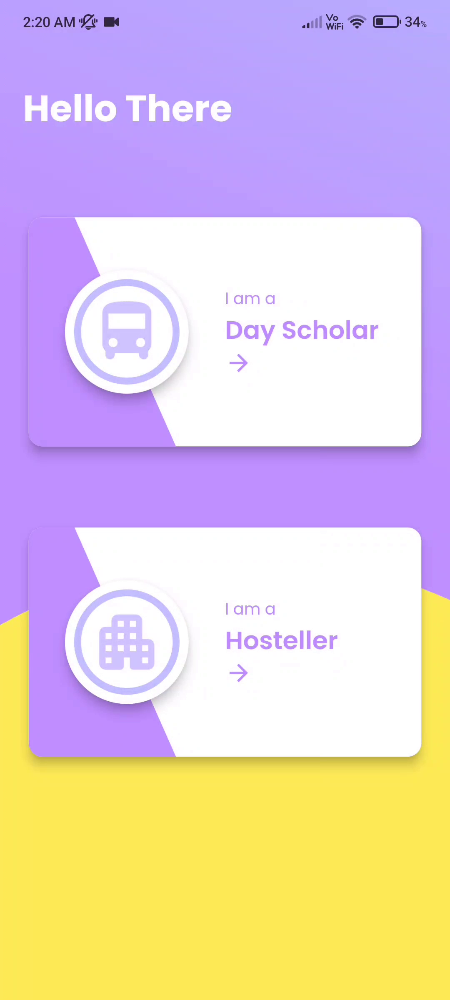
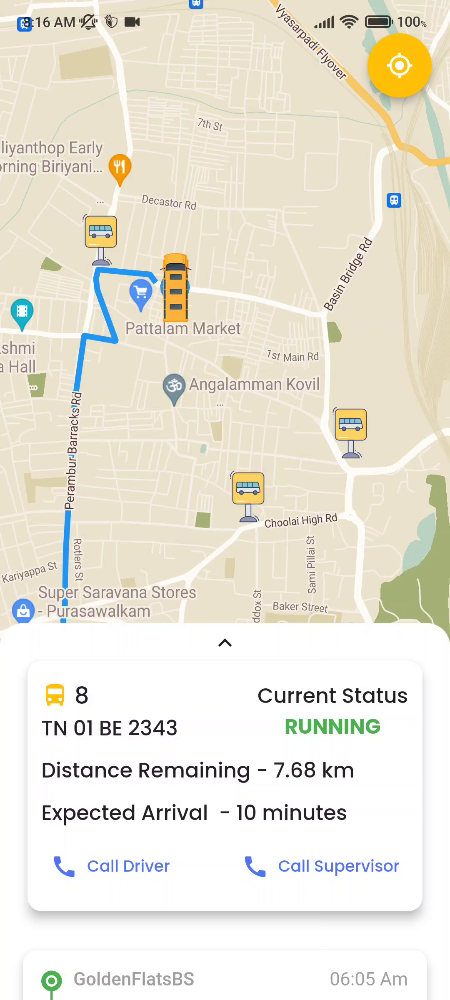
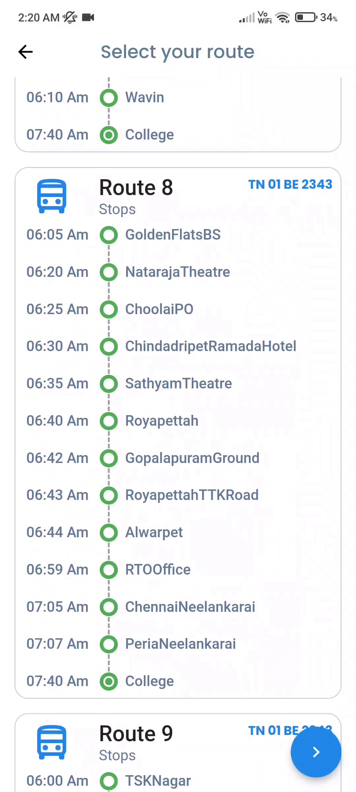
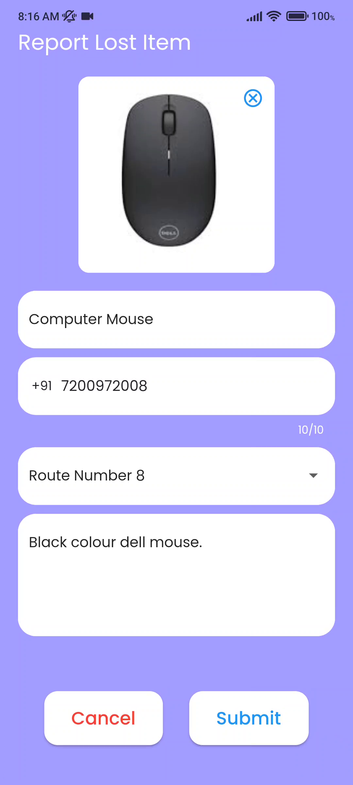
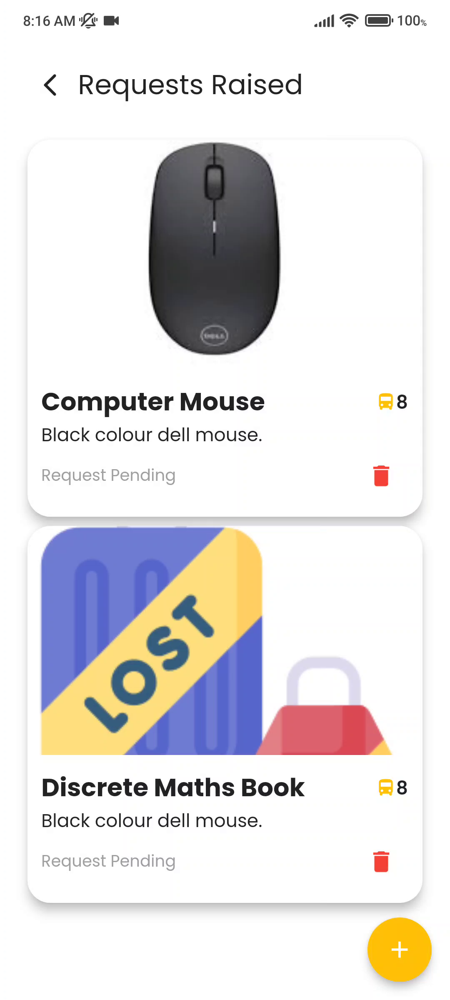

# 🚌 SSN Bus Tracking – User App (Students & Faculty)

A cross-platform mobile application built using Flutter that enables students and faculty members of SSN College of Engineering to **track college buses in real-time**, receive **breakdown alerts**, and manage **lost & found** requests.

> Companion application to the [SSN Bus Tracking – Driver App](https://github.com/adeeteya/Ssnbt_Driver).

## 📲 Features

### 🎯 Real-Time Bus Tracking
- View the **live location** of your assigned college bus.
- Get **ETA** and **distance** to your selected stop.
- Automatic route selection based on your SSN credentials.

### 🔀 Change Route
- Temporarily switch to a different route (for travel with friends or changes in plan).

### 🧭 Lost & Found
- Raise a request with **item details**, optional **image upload**, and contact information.
- Track the status of your request (approved/pending/declined).

### 📞 Emergency Contact
- Directly call your **assigned driver** or **route supervisor** from the app in one tap.

## 🛠️ Tech Stack

| Layer               | Technology                             |
|--------------------|-----------------------------------------|
| UI Development     | Flutter (Dart)                          |
| Maps Integration   | Google Maps SDK + Directions API        |
| Authentication     | Google Sign-In (SSN Email Restriction)  |
| Backend Database   | Firebase Realtime Database              |
| State Management   | GetX                                    |
| Design & Prototyping | Figma                                 |
| IDE                | Android Studio                          |

## 🔐 Access Control

- 🔒 Only SSN email addresses can log in.
- 🧭 Location access is required to enable tracking features.
- 🛡️ All data is securely stored and managed via Firebase Cloud Firestore.

## 🧪 Testing Highlights

- ✅ Login restricted to verified SSN accounts.
- ✅ GPS & network checks to ensure location accuracy.
- ✅ Error handling for invalid inputs (e.g., phone number validation).
- ✅ Status updates: `IDLE`, `RUNNING`, `BREAKDOWN` reflected in real-time.

## 📸 Screenshots

| Screen | Preview |
|--------|---------|
| On Boarding Screen |  |
| Home Tracking Screen |  |
| Select Route Screen |  |
| Report Lost Item Screen |  |
| Lost and Found Screen |  |
